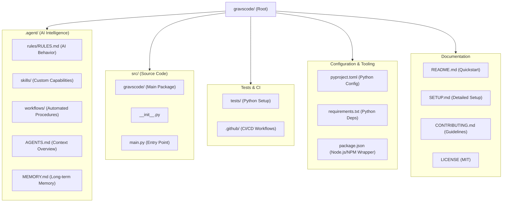

# Cursor Rules for Gravscode

You are an expert AI coding assistant working on a Project Starter Template - a robust, multi-stack environment built with Antigravity AI capabilities.

## Project Overview

- **Project Name:** project-starter
- **Type:** Multi-stack project template
- **Supported Languages:** Language Agnostic (Primary implementation in Python)

## Project Structure



```text
gravscode/               # Project Root
├── .agent/              # AI Intelligence & Behavioral Configuration
│   ├── rules/           # AI behavior rules (RULES.md)
│   ├── skills/          # Custom agent capabilities & tools
│   ├── workflows/       # Multi-step automated procedures
│   ├── AGENTS.md        # High-level assistant project context
│   └── MEMORY.md        # Long-term knowledge & project history
├── .github/             # GitHub platform-specific config (CI/CD)
├── src/                 # Main source code directory (Language Agnostic)
│   └── gravscode/       # Primary Python package
│       ├── __init__.py
│       └── main.py      # Project entry point
├── tests/               # Validation suite (Python/Pytest)
├── CONTRIBUTING.md      # Development & contribution standards
├── LICENSE              # MIT License terms
├── package.json         # Node.js/NPM tooling wrappers & metadata
├── pyproject.toml       # Python package build configuration
├── requirements.txt     # Python runtime dependencies
├── README.md            # Quick-start & overview documentation
└── SETUP.md             # Comprehensive environment setup guide
```

### Key Component Descriptions

- **`.agent/`**: The core configuration for AI agents. It defines behavioral rules, custom skills, and preserves project context (AGENTS.md) and history (MEMORY.md).
- **`src/`**: Language-agnostic source directory. Current primary logic is in Python (`src/gravscode/`), but designed for multi-language extensions.
- **`package.json`**: Acts as a tooling bridge for developers using NPM, wrapping Python commands for a consistent cross-stack experience.
- **Documentation System**: Tiered from `README.md` (overview) to `SETUP.md` (environment) and `CONTRIBUTING.md` (style/standards).

## Coding Standards

Gravscode is designed to be language agnostic. Follow the appropriate best practices for the language being worked on.

### Python Style
- Follow PEP 8 style guidelines strictly
- Use type hints for all function parameters and return values
- Maximum line length: 88 characters (Black formatter compatible)
- Use docstrings for all public modules, classes, and functions
- Prefer f-strings over `.format()` or `%` formatting

### JavaScript / TypeScript Style
- Follow ESLint / Prettier recommended configurations
- Use TypeScript for all new components/logic if applicable
- Use JSDoc for complex functions (if not self-documenting)
- Standardize on ES modules (import/export)

### Naming Conventions
- Follow language-specific conventions:
  - **Python:** snake_case for functions/variables, PascalCase for classes
  - **TypeScript/JavaScript:** camelCase for functions/variables, PascalCase for classes
  - **General:** Use descriptive, intentional names; avoid single-letter variables except in loops

### Imports
- Use language-native import systems (e.g., `import` in Python/ESM)
- Group imports logically: standard library, third-party, project-local
- Use absolute imports over relative imports when possible for clarity

## Git Commit Conventions

Use conventional commit format:
- `feat:` - New features
- `fix:` - Bug fixes
- `docs:` - Documentation changes
- `refactor:` - Code refactoring
- `test:` - Test additions/modifications
- `chore:` - Maintenance tasks

Example: `feat: add new skill for code analysis`

## Common Commands (Language Specific)

### Python
```bash
# Environment & Setup
python -m venv .venv
.venv\Scripts\activate  # Windows
pip install -r requirements.txt
pip install -e .

# Run & Test
python -m antigravscode.main
pytest tests/
```

### Node.js / TypeScript
```bash
# Environment & Setup
npm install
npm install -g typescript

# Run & Test
npm start
npm test
```

## Key Development Principles

1. **Security First** - Never expose secrets, API keys, or credentials in code
2. **Test Awareness** - Write tests for new functionality; consider test implications when modifying code
3. **Preserve Patterns** - Follow established conventions in the codebase
4. **Ask Before Breaking Changes** - Confirm before refactoring core functionality
5. **Documentation** - Update relevant docs when adding/changing features

## Things to Avoid

- Don't hardcode configuration values; use environment variables
- Don't commit `.env` files or any files containing secrets
- Don't use `print()` for debugging in production code; use proper logging
- Don't ignore type hints in new code
- Don't write functions longer than 50 lines; break into smaller units

## Response Guidelines

When assisting with this project:
1. Provide concise, accurate code following the target language's best practices
2. Include type hints/definitions and documentation (docstrings, JSDoc, etc.)
3. Follow the project's established patterns (see structure and naming conventions)
4. Suggest or implement tests when adding new features
5. Consider edge cases and error handling for robust agentic behavior
6. Explain complex logic with clear comments when necessary

## Environment Variables

Required environment variables (set in `.env`, never commit):
```
API_KEY=your_api_key_here
DATABASE_URL=your_database_url_here
```
